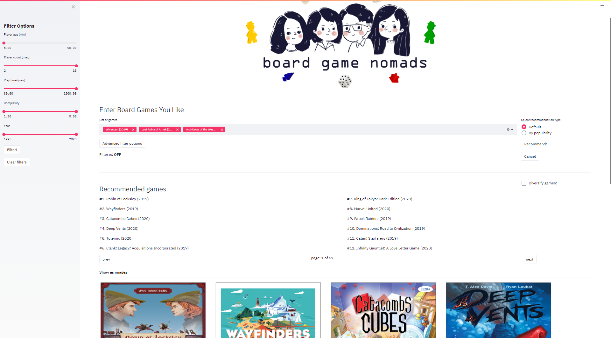

# Board Games Recommender

### Riche Ngo

## Introduction

[Board games](https://en.wikipedia.org/wiki/Board_game) are traditionally a subset of [tabletop games](https://en.wikipedia.org/wiki/Tabletop_game) that involve counters or pieces moved or placed on a pre-marked surface or board, according to a set of rules. While ancient board games like [Senet](https://en.wikipedia.org/wiki/Senet) and [Mehen](https://en.wikipedia.org/wiki/Mehen) existed when paper was invented, it was the 20th century that board games began to evolve dynamically in different directions. The two largest markets back then were the United States (US) and Germany, featuring two different broad categories of board games. In the US was where you could find [Ameritrash](https://en.wikipedia.org/wiki/Amerigame) games, devoted more towards [role-playing](https://en.wikipedia.org/wiki/Role-playing) games, often simulating warfare and adventure themes. On the other hand, [Eurogames](https://en.wikipedia.org/wiki/Eurogame) were developed by Germany, usually placing focus on the mechanics of the game and involving proper strategy. Several other board game genres have since appeared, such as [deckbuilders](https://en.wikipedia.org/wiki/Deck-building_game), [dexterity games](http://www.boardgamizer.com/mechanics/definition/dexterity), [roll-and-write games](http://sgl.la/blog/2018/4/27/what-is-a-roll-and-write-game), etc. In recent years, many board games comprise multiple game types, also taking elements of Ameritrash games while utilizing mechanics typical of Eurogames.

The global board games market size was worth an [estimated USD 13.1 Billion in 2019](https://blog.pipecandy.com/board-games-market/), and is expected to grow constantly. Another source forecasted that the board games market would reach [USD 30 Billion by 2026](https://www.arizton.com/market-reports/global-board-games-market-industry-analysis-2024), due to increasing popularity and acceptance among people despite the competition from digital entertainment sources. Living in the age of the internet, many board game blogs, forums, content creators surfaced and this will drive the board games market to become even larger.

## Problem Statement

Given the large growing board game community, more people are seeking for good methods to find their ideal board game. The newer, modern board games do not come cheap as the demand for good production value and immersive experiences in games increases. It is always a good idea to do some research on a particular board game before making the purchase. Commonly, people will use forums such as [BoardGameGeek](https://boardgamegeek.com/) and [Reddit](https://www.reddit.com/) to look for game recommendations. Some people turn to channels on [Youtube](https://www.youtube.com/) hosted by groups such as [Dice Tower](https://www.dicetower.com/) and [Watch It Played](https://en.wikipedia.org/wiki/Watch_It_Played) for video reviews on board games. However, more often than not, these outlets would suggest the same popular board games in the community, and it would almost never be personalized to each individual.

As part of a data science team affiliated to the major board game forum BoardGameGeek (BGG), we want to build a good board game recommender system to reduce user churn, increase the time spent on the website, and attract new users to the BGG community. We want to focus on building a great user experience when people use the recommender system and concentrate on giving personalized recommendations to each and every user.

## Executive Summary

This project explores data collected from the BoardGameGeek (BGG) website, comprising all information about the board games and the ratings given by users of the BGG community. We analyzed, dealt with missing values, and cleaned the datasets before using their features to build the recommender system.

The data consisted of information for over 90,000 board games listed on the website. Because quite a number of features had values contributed by the BGG community, the dataset contained a large percentage of missing values. Considering that and the relevance of each board game, we sieved out the older and unpopular board games. We uncovered many interesting things about the data, such as games listed with long playing times like [Risk](https://en.wikipedia.org/wiki/Risk_(game)) usually carry the theme of warfare or battle.

Through analysis, we saw that the number of board game publications had a steady increase from the Year 1995, and shot up further since the launch of [Kickstarter](https://www.kickstarter.com/) in 2009. Although the number of user ratings followed a similar trend, we observed a cyclical pattern, where the number of ratings generally plunges towards the mid of each year, then rises quickly nearing the end of each year. In addition, a large proportion of the board games are strategy games, involve cards, with dice rolling and/or hand management mechanics. We discovered that BGG uses a hidden formula to calculate a ["Geek Rating"](https://boardgamegeek.com/thread/1702432/what-geek-rating) which determines the ranking of each board game. Since it is a good indicator of popularity, we chose to trim the dataset down to games within the first 10,000 ranks. Exploring further, we found that the interquartile range of user ratings between 6.0 and 8.0 (inclusive), 7.0 being the median (on a scale of 1.0 to 10.0). 

We built several recommender systems, adopting a range of techniques including matrix factorization and dimensionality reduction. After evaluating each one, the final recommender system which found to give the best results was built with an amalgamation of two systems. The first is a collaborative filtering system which locates a set of users in the BGG community who have similar board game preferences with the current user. The set of similar users would go through a deep neural network with trained entity embedding layers to detect similarities between user ratings and multiple board game features. The output would be a mutable list of recommendations.

A total of 9 broad topics were discovered after building a topic model based on the descriptions of the board games. This came in useful after we deployed the final recommender system in a web application using `Streamlit`. Users were given an option to diversify their already personalized recommendations based on the identified topics, allowing them to see a wider variety of board game recommendations. On top of that, many filtering options (such as by publication year, game complexity) were given to the user to further personalize their board game recommendations.

## Deployment

Constructing the four stages above as the main skeleton of the recommender system, it was deployed as a web application using `Streamlit`. 

The web application has the following features:
- User-friendly interface
- List of popular board games already loaded for user to browse right away
- Multi-selection input box for user to enter the board games he/she likes
- Personalized recommendations based on user input (can be listed by frequency or popularity)
- Option to show the board games as images
- Option to diversify the recommendations based on different identified topics
- Set of advanced filtering options to further personalize the recommendations

## Conclusions

Through this project, we gained many interesting insights on the board game genres and how they have evolved since the 20th century. Using data collected from BoardGameGeek (BGG), we were able to put together a recommender system utilizing matrix factorization, dimensionality reduction and even topic modelling techniques. The recommender system was built using a collaborative filtering function and a deep neural network with entity embeddings. Afterwhich, we optimize the user experience by providing several filtering settings and the option to diversify the game recommendations based on the 9 topics identified from the board game descriptions. This new recommender system would be a good platform for avid board gamers who seek personalized recommendations. We have high hopes of helping BGG to increase user retention, time spent on the website, and also bring in new users to the BGG community.

In the process of putting together the aforementioned recommender system, many recommenders were built and evaluated upon. Although user-based collaborative filtering was useful for the initialization of our recommender, it was found to be less effective on its own as a recommender. Similarly, item-based collaborative filtering and content-based recommenders are also not optimal if used on its own, despite being more intuitive for our use case as compared to the user-based counterpart. Deep neural network recommenders were built using `tensorflow_recommenders`, which comprised query and candidate towers. Progressively exploring the retrieval and ranking methods of the tensorflow ecosystem, we managed to combine them to develop a feature-rich network trained by optimizing a balance of top-N accuracy and root-mean-squared error. Further fine-tuning left us with a network using a single 32-dimension embedding layer. The motivation to add the user-based collaborative filtering tool to the neural network was to alleviate the common issue of user cold-start in recommenders.

Moving forward, the recommender system could be improved further if the weights of the model are constantly updated with new user ratings and board games. It would definitely ensure that the system is more relevant and up-to-date with current trends in the board game market. It is possible that the recommender could be better with more data from other major board game websites/forums as well. The only caveat is that the users from other websites may have developed distinctly different preferences. Providing game recommendations based on different community profiling may backfire and lead to increased user churn for BGG. We could also tap on the discussions among BGG users in the forum and deploy some Natural Language Processing techniques to develop more robust user profiles. With deeper understanding, we may be able to enhance our recommender system by providing more individualized game recommendations.

## Data

### Data Source

The data was scraped from [BoardGameGeek](https://boardgamegeek.com/), an online forum for board gaming hobbyists and a game database. The website's database covers over 90,000 game titles as of January 2021. Credits to Markus Shepherd, who created a [board game scraper](https://gitlab.com/recommend.games/board-game-scraper) for several major board game websites.

### Data Dictionary

| Feature | Description |
|-|-|
| bgg_id | Board game's ID on BoardGameGeek database. |
| name | Board game's name in English. |
| year | Board game's year of release. |
| game_type | Board game's associated game types (e.g. strategy game, thematic, etc.). |
| designer | Designer(s) of the board game. |
| artist | Artist(s) of the board game and its components. |
| publisher | Publisher(s) of the board game. |
| min_players | Minimum number of players for the board game by design. |
| max_players | Maximum number of players for the board game by design. |
| min_players_rec | Minimum number of players for the board game as recommended by the BGG community. |
| max_players_rec | Maximum number of players for the board game as recommended by the BGG community. |
| min_players_best | Best number of players minimally for the board game as suggested by the BGG community. |
| max_players_best | Best maximum number of players for the board game as suggested by the BGG community. |
| min_age | Minimum age for players to play the board game by design. |
| min_age_rec | Minimum age for players to play the board game as recommended by the BGG community. |
| min_time | Minimum time required for a single play-through of the board game as stated by the designer. |
| max_time | Maximum time required for a single play-through of the board game as stated by the designer. |
| category | Board game's associated categories (e.g. Adventure, Exploration, Fantasy, etc.). |
| mechanic | Board game's associated mechanics (e.g. Chaining, Drafting, Push Your Luck, etc.). |
| cooperative | Whether the board game has cooperative game play (0 means non-cooperative, 1 means cooperative). |
| compilation | Whether the board game is a compilation of others (0 means not compilation, 1 means compilation). |
| compilation_of | The set of items which the board game is a compilation of. |
| family | The broad families which the board game falls into (e.g. Two Player Only Games, Theme: Tropical Islands, etc.). |
| implementation | The bgg_id of the previous board game which this one is a re-implementation of. |
| integration | The bgg_id of another board game which this one integrates with. |
| rank | Board game's overall ranking on the BGG website. |
| num_votes | Total number of votes on rating the board game by the BGG community. |
| avg_rating | Board game's average rating given by the BGG community (On a scale of 1-10, 10 being the best while 1 being the worst). |
| stddev_rating | Standard deviation of board game's rating given by the BGG community. |
| bayes_rating | Board game's average rating using the Bayesian method.  |
| complexity | Board game's average rating for how difficult the game is to understand, by the BGG community (On a scale of 1-5, the lower the rating, the easier the game is to understand). |
| language_dependency | How language-dependent components (aside from the rules) are for those who do not speak the game published language (On a scale of 1-5, 5 means no necessary in-game text, 1 means unplayable in another language). |
| _id | Board game's associated ID with other websites (like BGA, WikiData, etc.). |
